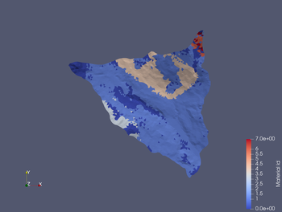

# map2mesh

A python-based workflow to map discrete values to a mesh.  Current
application is to prescribe geological layer types to general
unstructured meshes for integrated hydrological modeling.

## Dependencies

* `numpy` for array handling and interpolation between node values
* `matplotlib` to visualize array data
* `tinerator` for geodata handling and interpolation of values to mesh
* `pyvista` to visualize mesh

## License

[BSD-3](./LICENSE)

## Acknowledgment

This work is funded as part of the Watershed Function - Scientific
Focus Area by the U.S. Department of Energy, Office of Science, Office
of Biological and Environmental Research, Award no. DE-AC02-05CH11231.
